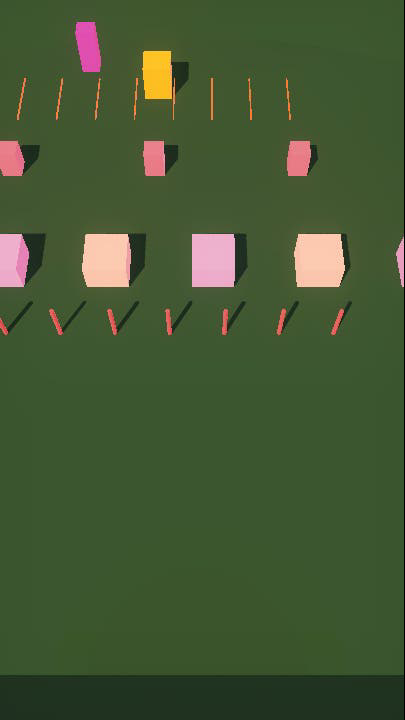
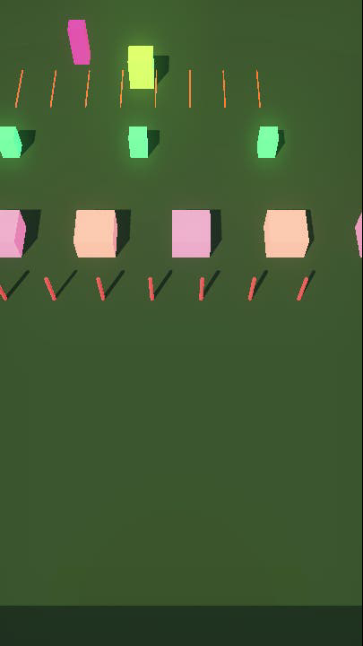
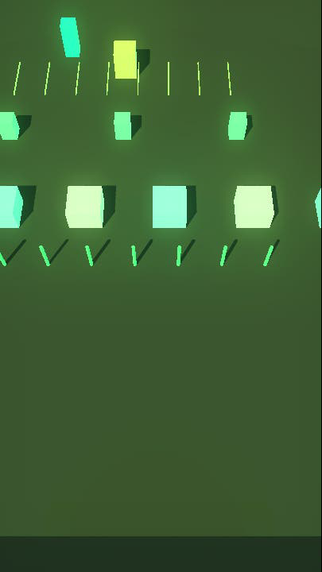
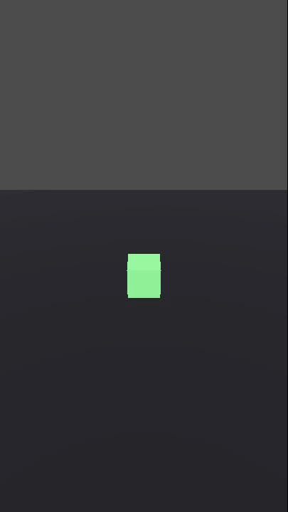
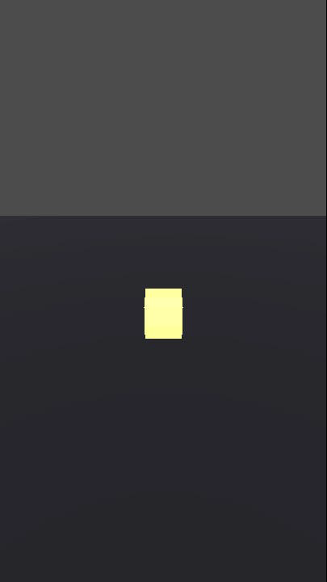
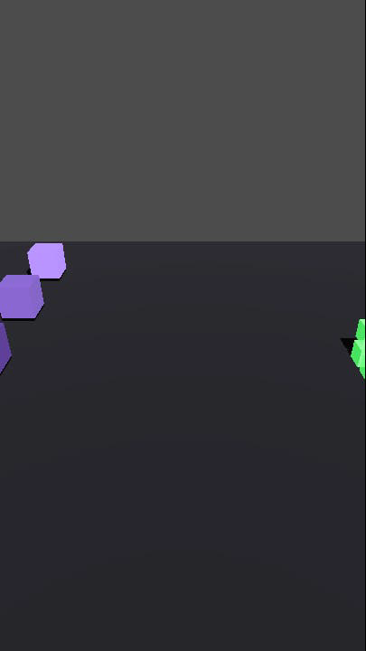

# Blocks

A composable Block primitive library for Godot 4. Blocks are lightweight `Resource` objects that define geometry, collision, materials, interaction rules, parent-child hierarchies, peer-to-peer connections, cellular division, LOD adaptation, and DNA-encoded behavior rules.

551 tests. Zero dependencies. Drop into any Godot 4.4+ project.

## Vision

Blocks are cells and neurons simultaneously. They divide like biological cells, connect like neural networks, and recombine like amoebas. A single block can subdivide into smaller blocks for higher detail, merge back together for lower detail, and encode division rules in DNA that propagate through generations.

This enables:
- **Adaptive LOD** — blocks subdivide on powerful hardware, stay coarse on weak hardware
- **Emergent movement** — organisms move by dividing at the front and merging at the rear
- **Self-assembling structures** — DNA rules guide how blocks split and what properties children inherit
- **Neural signal cascades** — messages propagate through connection graphs, triggering subdivision chains
- **Declarative worlds** — JSON files define Elements and Assemblies, the library builds the 3D scene tree
- **Spring physics** — blocks oscillate on springs with impulse propagation for bouncy, living structures
- **SDF blending** — smooth-union blending between adjacent blocks for organic shapes

## What's a Block?

A `Block` is a single Godot `Resource` with:

- **Identity** — unique `block_id`, human-readable `block_name`, tags
- **Geometry** — shape type (BOX, SPHERE, CYLINDER, CAPSULE, DOME, RAMP), dimensions
- **Collision** — layer/mask bits, server-collidable flag
- **Material** — color from a named palette (38 colors), roughness, metallic, noise displacement
- **Interaction** — category (STRUCTURE, PROP, TRIGGER, EFFECT), interactable flag, trigger zones
- **Links** — parent/child hierarchy via `parent_id` and `child_ids`
- **Connections** — peer-to-peer edges for arbitrary topologies (power grids, networks)
- **State** — runtime mutable dictionary for dynamic properties (powered, voltage, temperature)
- **Neuron** — reactive state bindings, BFS propagation, configurable options
- **Cellular** — `lod_level`, `parent_lod_id`, `child_lod_ids`, `min_size`, `dna`, `active`

## Architecture

```
scripts/blocks/
├── core/                       Entity + value objects (domain primitives)
│   ├── block.gd                Block Resource — identity, collision, visual, placement
│   ├── block_categories.gd     Shape/category/interaction/layer enums
│   └── block_messages.gd       Message type constants for neuron communication
│
├── building/                   Block Resource → Node3D subtree
│   ├── block_builder.gd        Mesh + collision shape factory
│   ├── block_materials.gd      Material palette + cache (38 colors)
│   ├── block_visuals.gd        Runtime emission/color + color chain animation
│   ├── block_mesh_merger.gd    Same-material mesh merging (draw call reduction)
│   ├── block_mesh_modifiers.gd Vertex displacement (noise, organic shaping)
│   ├── block_sdf_blender.gd   SDF smooth-union blending between blocks
│   └── block_shape_gen.gd     Pre-generated organic meshes (dome, ramp)
│
├── io/                         Serialization, file I/O, streaming
│   ├── block_file.gd           JSON parsing, path resolution, assembly composition
│   ├── block_exporter.gd       Server collision data export (TypeScript/GDScript)
│   ├── block_zone_loader.gd    Proximity-based zone streaming
│   └── block_pattern_expander.gd  Pattern expansion (ring, grid, line, scatter)
│
├── registry/                   Repository + quality gate
│   ├── block_registry.gd       Spatial grid, queries, peer connections, BFS routing
│   └── block_validator.gd      9-stage validation pipeline
│
├── rules/                      Placement constraints + connection logic
│   ├── block_placement_rule.gd Base class + static factory
│   ├── block_auto_connector.gd Spatial-grid auto-connection for assemblies
│   ├── endpoint_snap_rule.gd   Chain adjacency validation
│   ├── vertical_stack_rule.gd  Vertical stacking validation
│   └── placement_rule_stack.gd Rule composition (intersection of positions)
│
├── physics/                    Spring dynamics
│   ├── block_physics_state.gd  State schema constants
│   ├── block_spring.gd         Per-block spring oscillator
│   └── block_spring_system.gd  System update loop + impulse propagation
│
├── neurons/                    Behavior + reactive state binding
│   └── block_neuron.gd         State bindings, peer connections, BFS propagation
│
├── lod/                        Distance-based detail levels
│   └── block_lod_controller.gd Cellular LOD 0-3 (runs every 0.5s)
│
└── tests/                      Automated test suites (551 tests)
    ├── run_tests.gd            Car assembly suite (157 tests)
    ├── run_power_grid_tests.gd Power grid suite (394 tests)
    └── run_cellular_tests.gd   Cellular division suite
```

### Dependency Rules

```
core/         ← depends on nothing (except Godot builtins)
io/           ← depends on core/
registry/     ← depends on core/
building/     ← depends on core/ (BlockMaterials, BlockCategories)
rules/        ← depends on core/ (Block, BlockCategories)
physics/      ← depends on core/ (Block, BlockCategories)
neurons/      ← depends on core/ (Block)
lod/          ← depends on registry/ (BlockRegistry)
```

No circular dependencies. Each domain only looks inward/down, never sideways.

## Cellular System

Blocks can divide and recombine like living cells.

### Subdivision

```
         [4x4x4]              Split X          [2x4x4] [2x4x4]
         LOD 0         ──────────────────►       LOD 1    LOD 1

         [4x4x4]            Octree split       [2x2x2] x 8
         LOD 0         ──────────────────►       LOD 1
```

- `block.can_subdivide(axis)` — checks if dimension >= min_size * 2
- `block.subdivide(axis)` — splits into 2 children (single axis) or up to 8 (all axes for BOX)
- `block.merge_with(other)` — combines two blocks, infers merge axis from position delta
- Children inherit material, tags, interaction, collision, DNA per inheritance rules

### DNA

Blocks encode division rules in a `dna` dictionary:

| Key | Type | Effect |
|-----|------|--------|
| `axis_preference` | int (-1 to 2) | Preferred split axis (-1 = auto) |
| `child_count` | int (2, 4, 8) | Expected children per division |
| `inherit_tags` | bool | Whether children inherit parent tags |
| `property_overrides` | Dictionary | Properties to override on children |

## JSON Format

Blocks can be defined in JSON files. Elements are single blocks; Assemblies are composed groups.

### Element

```json
{
  "block_type": "element",
  "identity": { "name": "stone_wall", "category": "structure", "tags": ["wall"] },
  "collision": { "shape": "box", "size": [4, 3, 0.5], "interaction": "solid" },
  "visual": { "material": "stone_gray" }
}
```

### Assembly

```json
{
  "block_type": "assembly",
  "identity": { "name": "guard_tower", "category": "structure" },
  "children": [
    { "element_ref": "stone_wall", "position": [0, 0, 0] },
    { "element_ref": "stone_wall", "position": [4, 0, 0], "rotation_y": 90 },
    { "assembly_ref": "wooden_door", "position": [2, 0, 0] }
  ]
}
```

### Patterns

Pattern expansion generates blocks algorithmically:

```json
{
  "block_type": "assembly",
  "identity": { "name": "stone_ring" },
  "patterns": [
    { "type": "ring", "element_ref": "stone_pillar", "count": 8, "radius": 5 }
  ]
}
```

Supported patterns: `ring`, `grid`, `line`, `scatter`.

## Quick Start

```gdscript
# Create a block
var wall := Block.new()
wall.block_name = "Stone Wall"
wall.collision_shape = BlockCategories.SHAPE_BOX
wall.collision_size = Vector3(4, 3, 0.5)
wall.material_id = "stone_gray"

# Register and build
var registry := BlockRegistry.new()
registry.register(wall)
var node := BlockBuilder.build(wall, self)

# Connect two blocks
registry.connect_blocks(wall.block_id, "light_01")

# Send a message through connections
registry.send_message("light_01", "power_on", {"voltage": 120})

# BFS propagation through all connected blocks
var reached := registry.propagate_from(wall.block_id, "power_on", {"voltage": 120})

# Subdivide a block into children
var children := registry.subdivide_block(wall.block_id, 0)  # split along X

# Adapt all blocks to LOD level 2
registry.adapt_lod([wall.block_id], 2)

# Spring physics — register and apply impulse
var spring_system := BlockSpringSystem.new()
spring_system.register_block(wall)
spring_system.apply_impulse(wall.block_id, Vector3(0, 2, 0))

# Mesh merging — reduce draw calls for same-material blocks
BlockMeshMerger.merge_children(parent_node, 50.0)  # within 50m extent
```

## Integration

This library provides the primitives — your game provides the orchestrator. A typical integration pattern:

```gdscript
# Your game's autoload orchestrator (NOT part of this library)
extends Node

var registry := BlockRegistry.new()
var spring_system := BlockSpringSystem.new()

func load_zone(zone_path: String, parent: Node3D) -> void:
    var zone_data := BlockFile.load_file(zone_path)
    for asm in zone_data.get("assemblies", []):
        var blocks := BlockFile.file_to_assembly(asm, _resolve_element)
        for block in blocks:
            registry.register(block)
            var node := BlockBuilder.build(block, parent)
            if block.neuron:
                block.neuron.bind_to_block(block, registry)
```

## Tests

**551 tests across 3 suites, all passing.**

### Car Assembly (157 tests)
Builds a 12-block car (chassis, wheels, windows, headlights, exhaust) to test creation, validation, hierarchy, queries, collision export, and builder output.

```bash
godot --headless --script res://addons/blocks/tests/run_tests.gd
```

### Power Grid (394 tests)
Builds a 28-block electrical grid (generator, transformers, power lines, houses, street lights) to stress-test peer connections, BFS message propagation, runtime state, visual emission, cascade failures, and isolated components.

```bash
godot --headless --script res://addons/blocks/tests/run_power_grid_tests.gd
```

### Cellular System
Tests subdivision, merge, LOD adaptation, DNA inheritance, connection transfer, shape support, amoeba movement, and neural cascade propagation.

```bash
godot --headless --script res://addons/blocks/tests/run_cellular_tests.gd
```

### Screenshots

**Power Grid** — three visual states:

| Unpowered | Propagating | Fully Powered |
|-----------|-------------|---------------|
|  |  |  |

**Cellular System** — division, amoeba, LOD:

| Single Cell | Octree Division | LOD Comparison |
|-------------|-----------------|----------------|
|  |  |  |

See [`scripts/blocks/tests/README.md`](scripts/blocks/tests/README.md) for full test documentation.

## Requirements

- Godot 4.4+
- No external dependencies
