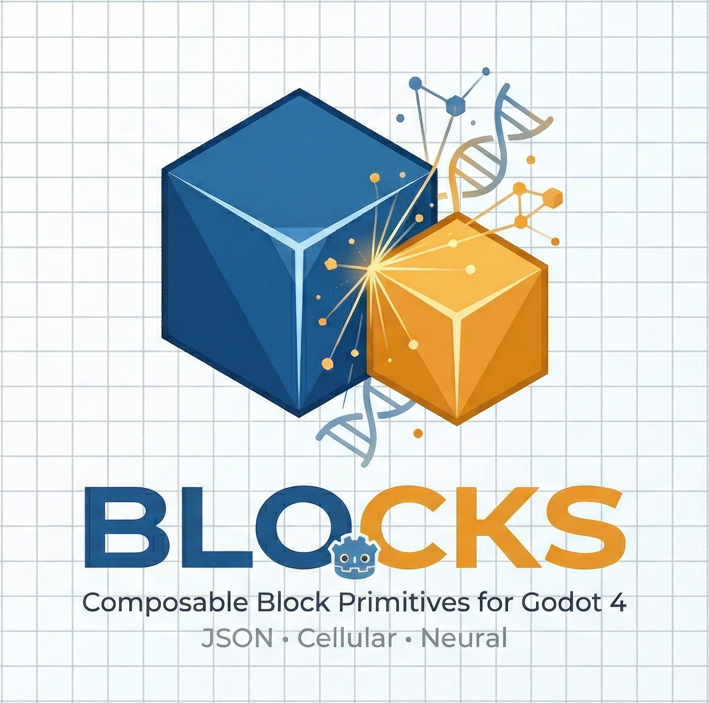

<p align="center">
  
</p>

A composable Block primitive library for Godot 4. Blocks are lightweight `Resource` objects that define geometry, collision, materials, lighting, interaction rules, parent-child hierarchies, peer-to-peer connections, cellular division, LOD adaptation, and DNA-encoded behavior rules.

809+ tests. Zero dependencies. Drop into any Godot 4.4+ project.

## Why JSON + Git

Your entire game world lives as plain-text JSON inside git. No proprietary binary formats. No scene files that can't be diffed. No merge conflicts on level design.

- **Every object** is a JSON entry — readable, diffable, mergeable
- **Multiple developers** can build different areas simultaneously and merge cleanly
- **`git blame`** shows who placed every object. **`git revert`** undoes any change instantly
- **Pull requests for level design** — review world changes the same way you review code
- **Featherweight world data** — the entire world layout is plain text. Binary assets (GLB models, textures) are the only heavy files
- **AI-friendly** — agents can read, generate, and modify world data programmatically. JSON is their native language
- **No vendor lock-in** — open data format, portable, engine-agnostic in principle

Think of it like HTML for 3D worlds: Blocks is the rendering engine that turns declarative JSON markup into a living 3D scene.

## Vision

Blocks are cells and neurons simultaneously. They divide like biological cells, connect like neural networks, and recombine like amoebas. A single block can subdivide into smaller blocks for higher detail, merge back together for lower detail, and encode division rules in DNA that propagate through generations.

This enables:
- **Adaptive LOD** — blocks subdivide on powerful hardware, stay coarse on weak hardware
- **Emergent movement** — organisms move by dividing at the front and merging at the rear
- **Self-assembling structures** — DNA rules guide how blocks split and what properties children inherit
- **Neural signal cascades** — messages propagate through connection graphs, triggering subdivision chains
- **Declarative worlds** — JSON files define Elements and Assemblies, the library builds the 3D scene tree
- **Spring physics** — blocks oscillate on springs with impulse propagation for bouncy, living structures
- **SDF blending** — smooth-union blending between adjacent blocks for organic shapes
- **Declarative lighting** — blocks define lights in JSON, builder creates OmniLight3D/SpotLight3D automatically
- **HTML-grade resilience** — missing assets show magenta placeholders, broken refs are skipped gracefully

## What's a Block?

A `Block` is a single Godot `Resource` with:

- **Identity** — unique `block_id`, human-readable `block_name`, tags
- **Geometry** — shape type (BOX, SPHERE, CYLINDER, CAPSULE, DOME, RAMP, CONE, TORUS, ARCH, ROCK), dimensions
- **Collision** — layer/mask bits, server-collidable flag
- **Material** — color from a named palette (58+ colors), roughness, metallic, noise displacement
- **Light** — declarative light config (omni/spot, color, energy, range, group, shadows)
- **Interaction** — category (STRUCTURE, PROP, TRIGGER, EFFECT, FURNISHING, TREE), interactable flag, trigger zones
- **Links** — parent/child hierarchy via `parent_id` and `child_ids`
- **Connections** — peer-to-peer edges for arbitrary topologies (power grids, networks)
- **State** — runtime mutable dictionary for dynamic properties (powered, voltage, temperature)
- **Neuron** — reactive state bindings, BFS propagation, configurable options
- **Cellular** — `lod_level`, `parent_lod_id`, `child_lod_ids`, `min_size`, `dna`, `active`

## Architecture

```
addons/blocks/
├── core/                       Entity + value objects (domain primitives)
│   ├── block.gd                Block Resource — identity, collision, visual, light, placement
│   ├── block_categories.gd     11 shapes, 8 categories, 9 interactions, layers
│   └── block_messages.gd       Message type constants for neuron communication
│
├── building/                   Block Resource → Node3D subtree
│   ├── block_builder.gd        Mesh + collision + light factory, GLB/scene support, placeholder fallback
│   ├── block_materials.gd      Material palette + cache (58+ colors), procedural material types
│   ├── block_visuals.gd        Runtime emission/color + color chain animation
│   ├── block_mesh_merger.gd    Same-material mesh merging with face culling (draw call reduction)
│   ├── block_mesh_modifiers.gd Vertex displacement (noise, organic shaping)
│   ├── block_sdf_blender.gd    SDF smooth-union blending (Marching Cubes)
│   └── block_shape_gen.gd      Pre-generated organic meshes (arch, rock)
│
├── io/                         Serialization, file I/O, streaming
│   ├── block_file.gd           JSON parsing, path resolution, assembly composition, light config
│   ├── block_exporter.gd       Server collision data export (TypeScript/GDScript)
│   ├── block_zone_loader.gd    Proximity-based zone streaming with hysteresis
│   └── block_pattern_expander.gd  Pattern expansion (ring, grid, line, scatter, along_path)
│
├── registry/                   Repository + quality gate
│   ├── block_registry.gd       Spatial grid (20m cells), queries, peer connections, BFS routing
│   └── block_validator.gd      9-stage validation pipeline
│
├── rules/                      Placement constraints + connection logic
│   ├── block_placement_rule.gd Base class + static factory
│   ├── block_auto_connector.gd Spatial-grid auto-connection (2m radius, validated)
│   ├── endpoint_snap_rule.gd   Chain adjacency validation
│   ├── vertical_stack_rule.gd  Vertical stacking validation
│   └── placement_rule_stack.gd Rule composition (intersection of positions)
│
├── physics/                    Spring dynamics
│   ├── block_physics_state.gd  State schema constants
│   ├── block_spring.gd         Per-block spring oscillator
│   └── block_spring_system.gd  System update loop + impulse propagation (0.6^n attenuation)
│
├── neurons/                    Behavior + reactive state binding
│   └── block_neuron.gd         State bindings, peer connections, BFS propagation
│
├── lod/                        Distance-based detail levels
│   └── block_lod_controller.gd Cellular LOD 0-3, depth-limited subdivision (max 8)
│
└── tests/                      Automated test suites (809+ assertions)
```

### Dependency Rules

```
core/         ← depends on nothing (except Godot builtins)
io/           ← depends on core/
registry/     ← depends on core/
building/     ← depends on core/ (BlockMaterials, BlockCategories)
rules/        ← depends on core/ (Block, BlockCategories)
physics/      ← depends on core/ (Block, BlockCategories)
neurons/      ← depends on core/ (Block)
lod/          ← depends on registry/ (BlockRegistry)
```

No circular dependencies. Each domain only looks inward/down, never sideways.

## Lighting System

Blocks can declare lights directly in JSON. The builder creates real Godot lights automatically.

```json
{
  "block_type": "element",
  "identity": { "name": "tiki_torch_flame", "category": "effect" },
  "collision": { "shape": "sphere", "size": [0.12, 0.24, 0.12], "interaction": "none" },
  "visual": { "material": "glow_orange", "cast_shadow": false },
  "light": {
    "type": "omni",
    "color": [1.0, 0.7, 0.3],
    "energy": 1.2,
    "range": 5.0,
    "group": "lanterns",
    "shadow": false
  }
}
```

- **Types**: `omni` (OmniLight3D) or `spot` (SpotLight3D)
- **Group**: Lights are added to `block_{group}` Godot group for batch discovery (e.g., day/night cycle finds all `block_lanterns` lights)
- **Spot extras**: `spot_angle`, `spot_range` for directional lights

## Resilience (HTML-Grade)

The blocks system is designed like a browser rendering HTML — show what you can, skip what you can't, never crash.

- **Missing scene/GLB**: Shows a bright **magenta placeholder box** instead of invisible nothing
- **Missing element_ref**: Logs warning, skips that child, continues loading the rest
- **Validation rejection**: Warns with details, block is skipped but world keeps loading
- **Freed factory node**: Zone loader checks `is_instance_valid()` every update, fails gracefully
- **Subdivision runaway**: Depth limit of 8 prevents infinite recursion / memory explosion
- **Missing material**: Falls back to white, logs the material key that wasn't found
- **Broken peer connection**: `unregister()` cleans up both sides, `get_block()` returns null (not crash)

## Shapes

11 primitive shapes, each with appropriate collision and mesh generation:

| Shape | Collision | Mesh | Size Interpretation |
|-------|-----------|------|---------------------|
| BOX | BoxShape3D | BoxMesh | W x H x D |
| CYLINDER | CylinderShape3D | CylinderMesh | radius x height |
| CAPSULE | CapsuleShape3D | CapsuleMesh | radius x height |
| SPHERE | SphereShape3D | SphereMesh | radius (X only) |
| RAMP | ConvexPolygonShape3D | Custom wedge | W x H x D |
| DOME | ConvexPolygonShape3D | Hemisphere | radius x height |
| CONE | CylinderShape3D (tapered) | ConeMesh | radius x height |
| TORUS | StaticBody3D (multi) | TorusMesh | inner_r x outer_r |
| ARCH | StaticBody3D (multi) | Half-torus | inner_r x outer_r |
| ROCK | ConvexPolygonShape3D | Noise-displaced sphere | radius |
| NONE | No collision | No mesh | — |

## Mesh Merger

Reduces draw calls by combining same-material meshes within an assembly:

- **Minimum**: 4+ blocks to trigger merging
- **Maximum extent**: 40m (prevents single merged mesh spanning entire map)
- **Face culling**: Adjacent BoxMesh faces that touch (within 0.05m tolerance) are removed
- **Material grouping**: Only meshes with identical materials are merged

## SDF Blender

Spawn-time smooth-union organic mesh generation via Marching Cubes:

- Combines sphere, box, and cylinder shapes into smooth organic blobs
- Configurable `blend_k` (smooth radius) per assembly
- Resolution controls voxel grid density
- Replaces individual block meshes with a single organic surface

## Pattern Expander

Algorithmic instance generation for repetitive placements:

```json
{
  "patterns": [
    { "type": "ring", "element_ref": "stone_pillar", "count": 8, "radius": 5 },
    { "type": "grid", "element_ref": "floor_tile", "rows": 4, "cols": 4, "spacing": 1.2 },
    { "type": "scatter", "element_ref": "bush", "count": 20, "radius": 10, "seed": 42 }
  ]
}
```

Supported: `ring`, `grid`, `line`, `scatter`, `along_path`. Each supports variation (seed, scale_jitter, rotation_jitter, position_jitter, material_variants). Max 200 instances per pattern.

## Cellular System

Blocks can divide and recombine like living cells.

### Subdivision

```
         [4x4x4]              Split X          [2x4x4] [2x4x4]
         LOD 0         ──────────────────►       LOD 1    LOD 1

         [4x4x4]            Octree split       [2x2x2] x 8
         LOD 0         ──────────────────►       LOD 1
```

- `block.can_subdivide(axis)` — checks if dimension >= min_size * 2
- `block.subdivide(axis)` — splits into 2 children (single axis) or up to 8 (all axes for BOX)
- `block.merge_with(other)` — combines two blocks, infers merge axis from position delta
- Children inherit material, tags, interaction, collision, DNA per inheritance rules
- Subdivision depth limited to 8 levels (prevents runaway)

### DNA

Blocks encode division rules in a `dna` dictionary:

| Key | Type | Effect |
|-----|------|--------|
| `axis_preference` | int (-1 to 2) | Preferred split axis (-1 = auto) |
| `child_count` | int (2, 4, 8) | Expected children per division |
| `inherit_tags` | bool | Whether children inherit parent tags |
| `property_overrides` | Dictionary | Properties to override on children |

## Validation Pipeline

9-stage validation catches errors before blocks enter the registry:

1. **Identity** — block_name present, category in range [0,7]
2. **Dimensions** — collision_size within bounds [0.01, 500]
3. **Layers** — collision_layer valid, interaction-layer consistency
4. **Visual/Collision ratio** — mesh and collision size within 3-5x of each other
5. **Interaction** — type valid, trigger has shape + radius
6. **Position** — within world bounds (XZ ±500m, Y [-50, 400])
7. **Links** — parent/child chain has no cycles
8. **Connections** — peer edges are bidirectional
9. **LOD** — cellular constraints valid

## JSON Format

### Element

```json
{
  "format_version": "1.0",
  "block_type": "element",
  "identity": { "name": "stone_wall", "category": "structure", "tags": ["wall"] },
  "collision": { "shape": "box", "size": [4, 3, 0.5], "interaction": "solid" },
  "visual": { "material": "stone" },
  "light": { "type": "omni", "color": [1, 0.9, 0.7], "energy": 1.5, "range": 8 }
}
```

### Assembly

```json
{
  "format_version": "1.0",
  "block_type": "assembly",
  "identity": { "name": "guard_tower", "category": "structure" },
  "neuron": { "options": {}, "state_bindings": {} },
  "children": [
    { "element_ref": "structure/stone_wall", "placement": { "position": [0, 0, 0] } },
    { "element_ref": "structure/stone_wall", "placement": { "position": [4, 0, 0], "rotation_y": 1.5708 } },
    { "element_ref": "lighting/torch_flame", "placement": { "position": [2, 3, 0] } }
  ]
}
```

## Quick Start

```gdscript
# Create a block
var wall := Block.new()
wall.block_name = "Stone Wall"
wall.collision_shape = BlockCategories.SHAPE_BOX
wall.collision_size = Vector3(4, 3, 0.5)
wall.material_id = "stone"

# Register and build
var registry := BlockRegistry.new()
registry.register(wall)
var node := BlockBuilder.build(wall, self)

# Connect two blocks
registry.connect_blocks(wall.block_id, "light_01")

# Send a message through connections
registry.send_message("light_01", "power_on", {"voltage": 120})

# BFS propagation through all connected blocks
var reached := registry.propagate_through_connections(wall.block_id, "power_on", {"voltage": 120})

# Subdivide a block into children
var children := registry.subdivide_block(wall.block_id, 0)  # split along X

# Spring physics — register and apply impulse
var spring_system := BlockSpringSystem.new()
spring_system.register_block(wall)
spring_system.apply_impulse(wall.block_id, Vector3(0, 2, 0))

# Mesh merging — reduce draw calls
BlockMeshMerger.merge_children(parent_node, 50.0)
```

## Integration

This library provides the primitives — your game provides the orchestrator:

```gdscript
# Your game's autoload orchestrator (NOT part of this library)
extends Node

var registry := BlockRegistry.new()
var spring_system := BlockSpringSystem.new()
var lod := BlockLodController.new(registry)

func load_zone(zone_path: String, parent: Node3D) -> void:
    var zone_data := BlockFile.load_file(zone_path)
    for asm in zone_data.get("assemblies", []):
        var blocks := BlockFile.file_to_assembly(asm, _resolve_element)
        for block in blocks:
            registry.register(block)
            BlockBuilder.build(block, parent)
            if block.neuron:
                block.neuron.bind_to_block(block, registry)

func _process(delta):
    spring_system.step(delta)
    lod.update(camera.global_position, world_root)
```

## Tests

**809+ assertions across 8 test suites.**

| Suite | Tests | What it covers |
|-------|-------|----------------|
| Car Assembly | 340 | Creation, validation, hierarchy, queries, collision export, builder, light |
| Power Grid | 280 | 28-block grid, peer connections, BFS propagation, state, emission, cascade |
| Cellular | 261 | Subdivision, merge, LOD, DNA, connection transfer, amoeba, neural cascade |
| Mesh Merger | 47 | Material grouping, face culling, extent limits |
| Patterns | 62 | Ring, grid, line, scatter, along_path, variation |
| SDF Blender | 68 | Smooth-union, Marching Cubes, shape combinations |
| Physics | 93 | Spring oscillation, impulse propagation, state schema |

```bash
# Run all suites
godot --headless --script res://addons/blocks/tests/run_tests.gd
godot --headless --script res://addons/blocks/tests/run_power_grid_tests.gd
godot --headless --script res://addons/blocks/tests/run_cellular_tests.gd
godot --headless --script res://addons/blocks/tests/run_mesh_merger_tests.gd
godot --headless --script res://addons/blocks/tests/run_pattern_tests.gd
godot --headless --script res://addons/blocks/tests/run_sdf_blender_tests.gd
```

## Requirements

- Godot 4.4+
- No external dependencies
